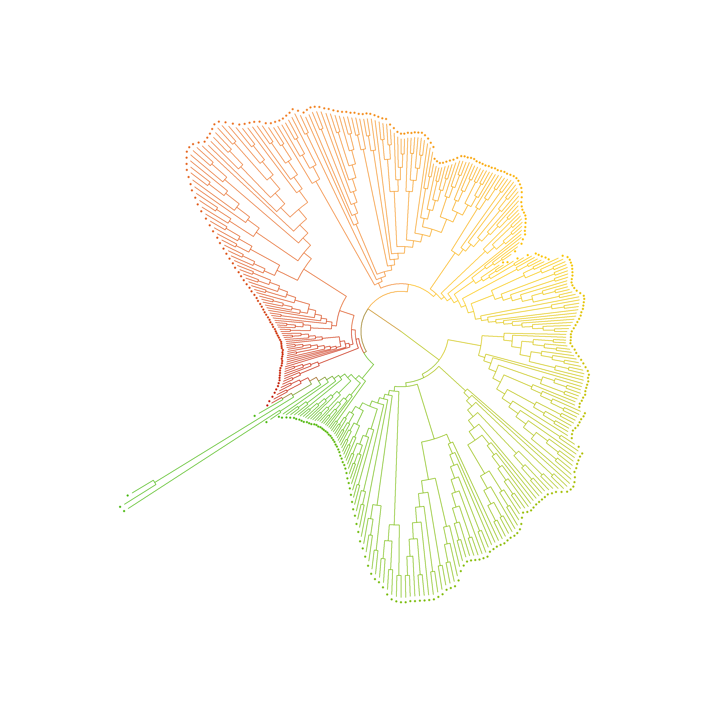
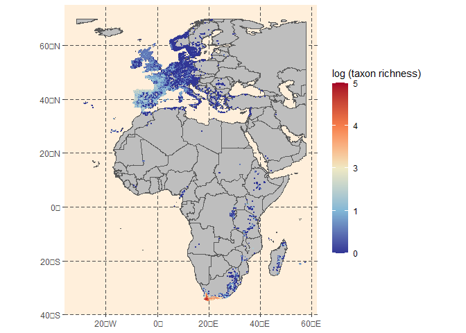
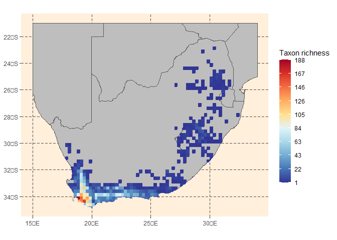
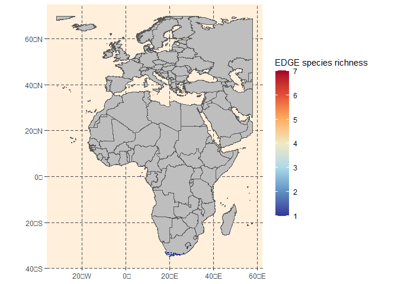
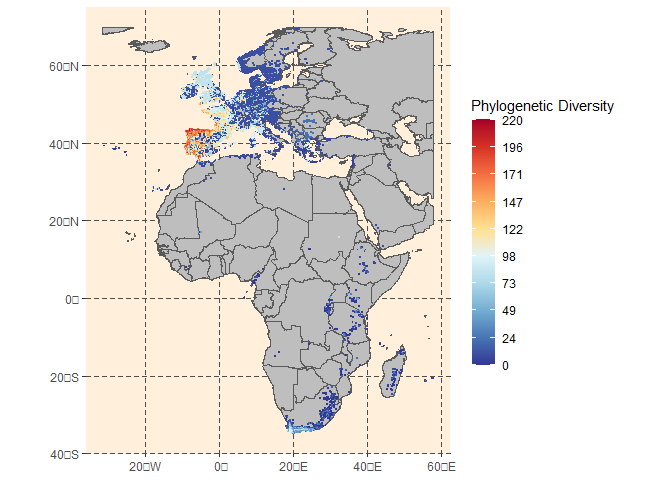
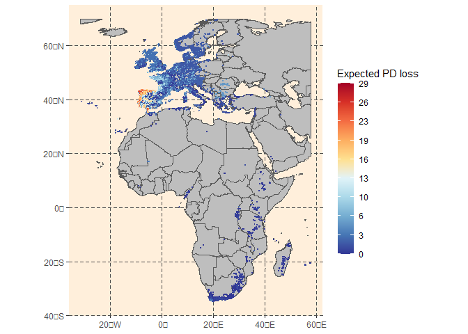
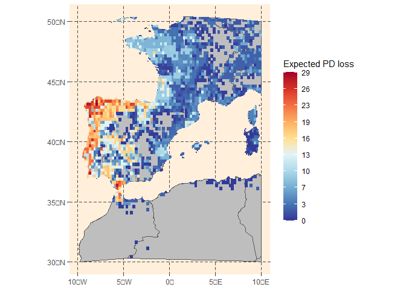

# Evolutionarily Distinct and Globally Endangered plants Workshop

In this workshop we are going to work with a dataset used to calculate
EDGE values and spatial approaches within the heath genus (*Erica*).

Data and part of the code come from [Pirie et
al. (2024)](https://phytokeys.pensoft.net/article/124565/).

EDGE2 calculations are based on code by R. Gumbs available in GitHub
(<https://github.com/rgumbs/EDGE2>).

## 0. Loading our functions

Some internal functions to clarify the process, stored in the
“workshop\_functions.R” script.

    source("workshop_functions.R")

## 1. Expanding phylogenies - the randtip package

The first thing we have to do is to expand our *Erica* phylogeny to make
it comprehend all the extant species. To do so, in this case we are
going to explore the *randtip* package ([Ramos-Gutiérrez *et al.*,
2023](https://onlinelibrary.wiley.com/doi/full/10.1111/geb.13733)).

First, we have to load our libraries and data to work with. Here we have
an incomplete molecular phylogeny (just 555/901 taxa), and a complete
list of them, along with some information, as can be their region, their
Red List category, or if they are included in the tree or not.

    library(devtools)
    # install_github("iramosgutierrez/randtip")
    library(randtip)

    ericatree <- read.tree("files/Erica_incoplete.tre") # A sampled phylogeny
    erica.table <- read.csv("files/ericatable.csv") #list of species & info

Once we have our taxa list, we can create *randtip’s* ‘info’ data frame.
To do so, we use

    erica.info <- build_info(erica.table$taxa, ericatree, mode="list",prior.info = plants.info)

For all species not included in the tree pertaining to the cape region,
we define the clade to be bound as the clade in which all the rest of
the cape species live (i.e. the clade defined between *Erica
pauciovulata* and *E. dregei*)

    cape2include <- erica.table$taxa[erica.table$region == "CAPE" & erica.table$incl==0]
    capeincluded <- erica.table$taxa[erica.table$region == "CAPE" & erica.table$incl==1]

    erica.info <- edit_info(info = erica.info, taxa = cape2include, column = "taxon1", edit =  "Erica_pauciovulata")
    erica.info <- edit_info(info = erica.info, taxa = cape2include, column = "taxon2", edit =  "Erica_dregei")

Once we have our ‘info’ edited, we can wrap up and expand the phylogeny.

    erica.input <- info2input(erica.info, ericatree, F)
    ericatree.complete <- rand_tip(input = erica.input, ericatree, verbose = F)

    plot.phylo(ericatree.complete, cex=0.6,tip.color = put_tip_col(ericatree.complete,ericatree, ) )

This process should be repeated 100-1000 times to integrate phylogenetic
uncertainty into analyses.

## 2. Calculate individual EDGE scores

This section has been performed following the EDGE2 protocol, developed
in [Gumbs et al. (2023)](https://doi.org/10.1371/journal.pbio.3001991).

To calculate EDGE scores, we need a data frame with all the species
(which must be included in the phylo trees), along with their Red List
assessment categories. Depending on them, a probability of extinction
will be assigned to each species. DD and NE taxa will be sampled an
extinction probability between 0 and 1.

      GE2vals <- GE.2.calc(pext.vals)
     
      erica.pext <- data.frame("species" = erica.table$taxa ,
                               "RL"= erica.table$RL.cat,
                               "pext" = NA)
      
        for(sp in erica.pext$species){
        progressbar(which(erica.pext$species == sp), length(erica.pext$species))
        cat.i <- erica.pext$RL[erica.pext$species==sp]
        if(cat.i =="NE"){pext.i <- runif(1,0.0001, 0.9999)}else
          if(cat.i =="EX"){cat.i =="CR"}else{
        pext.i <- sample(GE2vals$pext[GE2vals$RL.cat==cat.i], size = 1)}
        erica.pext$pext[erica.pext$species== sp] <- pext.i
      }
      erica.pext2 <- erica.pext
      erica.pext2$RL<-NULL

Using function *‘EDGE2\_mod’* we obtain 3 objects: a data frame with
individual values, a tree with internal probability of extinctions of
each branch and a global value of PD and Expected PD Loss.

      erica.edge <- EDGE2_mod(tree = ericatree.complete, pext = erica.pext2)

      edgevalues <- erica.edge[[1]]
      epdloss.trees <- erica.edge[[2]]
      EricaPD <- erica.edge[[3]]

Once again, these calculations should be performed once for every tree
to consider phylogenetic as well as extinction probability
uncertainties.

## 3. Spatial applications of EDGE

This section will follow the studied aspects of EDGE shown in [Pirie et
al. (2024)](https://phytokeys.pensoft.net/article/124565/).

First we will need some new libraries. Additionally, we need a cleaned,
curated occurrence dataset for all our taxa of interest.

    library(raster)
    library(sf)
    library(reshape)
    library(ggplot2)
    library(RColorBrewer)

    erica <- read.csv(file = 'files/Erica_occ_cleaned.csv')

We have now to create a blank raster with the extent and resolution we
want to use, and make some conversions to create also a spatial data
frame.

    r25<-raster(xmn=-35, xmx=60, ymn=-37, ymx=72,
                crs="+proj=longlat +datum=WGS84 +no_defs ",
                resolution=c(0.25,0.25), vals = NA)

    erica2 <- erica
    coordinates(erica2) <- ~x+y
    proj4string(erica2)<- CRS("+proj=longlat +ellps=WGS84 +datum=WGS84 +no_defs")
    r <- rasterize(erica2, r25, field="taxon", fun=function(x,...) length(unique(na.omit(x))))
    plot(r, col = 'red')

    # Extract values into data frame
    erica.sf <- st_as_sf(erica2)
    erica.grid <- c()
    for(i in 1:length(unique(erica.sf$taxon))){ # takes a couple minutes to run
      progressbar(i, length(unique(erica.sf$taxon)))
      cells <- as.data.frame(raster::extract(r, erica.sf[which(erica.sf$taxon==unique(erica.sf$taxon)[i]),], cellnumbers=T))
      y<-as.data.frame(raster::extract(r, erica.sf[which(erica.sf$taxon==unique(erica.sf$taxon)[i]),], cellnumbers =T))
      y$taxon <- unique(erica.sf$taxon)[i]
      y <- cbind(y, xyFromCell(r,y[,1]))
      colnames(y)[4:5] <- c('X','Y')
      erica.grid <- rbind(erica.grid, y)
    }

    erica.grid$X_Y <- paste(erica.grid$X, erica.grid$Y, sep = '_')
    erica.grid$layer<-NULL
    erica.grid<- unique(erica.grid)

### 3.1 Mapping Taxon richness

A first approach would be mapping the number of taxa existing in each
pixel.

    # Grid to taxon richness raster
    rich.rast <- erica.grid
    rich.rast <- cast(melt(rich.rast[,c('taxon', 'X', 'Y')], id = c('X', 'Y')), fun.aggregate = length)
    rich.rast <- as.data.frame(rich.rast)
    coordinates(rich.rast) <- ~X+Y
    gridded(rich.rast) <- T
    rich.rast<-raster(rich.rast)
    plot(rich.rast, col = 'red')

    # from SPDF to DF, retaining ID and trename columns
    df <- as.data.frame(erica2, xy=T)
    ID.df<-cbind(df, xyFromCell(r,cellFromXY(r,df[c("x","y")][c(1:nrow(df)),])))
    ID.df$xy <- NULL
    ID.df$X <- NULL
    colnames(ID.df) <- c('taxon', 'ID',  'x', 'y','trenames', 'X', 'Y')
    ID.df$X_Y <- paste(ID.df$X, ID.df$Y, sep = '_')
    ID.df$x <- NULL
    ID.df$y <- NULL
    # write.csv(ID.df, file = './Erica/Erica-ID-grid.csv')
    # ID.df<-read.csv(file = './Erica/Erica-ID-grid.csv')

    # Load worldmap 
    library(rnaturalearth)
    library(rnaturalearthhires)
    library(dplyr)
    worldmap <- ne_countries(scale = 'large', returnclass = 'sf')
    worldmap <- worldmap %>% filter(admin!= 'Antarctica')
    cropmap <- worldmap$geometry
    sf_use_s2(FALSE)
    cropmap<-st_crop(cropmap, st_bbox(rich.rast))
    # colour scheme
    cols <- brewer.pal(10, 'RdYlBu')
    pal <- colorRampPalette(cols)

    # Richness raster
    erica.grid2 <- unique(ID.df[,c('taxon','X','Y','X_Y')])
    rich.rast <- erica.grid2
    rich.rast <- cast(melt(rich.rast[,c('taxon', 'X', 'Y')], id = c('X', 'Y')), fun.aggregate = length)
    rich.rast <- as.data.frame(rich.rast)
    coordinates(rich.rast) <- ~X+Y
    gridded(rich.rast) <- T
    rich.rast<-raster(rich.rast)
    plot(rich.rast)

    # Raster to polygon 
    ep <- rasterToPolygons(rich.rast) # ep erica polygon
    ep <- st_as_sf(ep)
    ep$log <- log(ep$taxon)

    # add log sequence
    pos<-seq(min(ep$log), max(ep$log), length.out = 10)
    lab.2 <- exp(pos)
    lab.3 <- seq(1, max(ep$taxon), length.out= 11) 

    customplot(cropmap, ep2, "Taxon richness", col="log")

And zoom into South Africa… In this case examining the richness (not
converted to logarithmic scale).

    # cropped version
    st_crs(ep) <- st_crs(cropmap)
    ep2 <- st_intersection(ep, cropmap)
    vals <- as.character(cut(ep2$log, breaks = 10, labels = rev(pal(10))))
    pos<-seq(min(ep2$log), max(ep2$log), length.out = 10)
    lab.2 <- exp(pos)
    lab.3 <- seq(1,max(ep$taxon), length.out= 11)

    cropmap.sa<-st_crop(cropmap, st_bbox(c(xmin = 15, ymin = -35, 
                                           xmax = 34, ymax = -21)))
    ep2.sa <- st_intersection(ep2, cropmap.sa)

    customplot(cropmap.sa, ep2.sa, "Taxon richness", col="taxon")

### 3.2 EDGE species richness

In this second step, we will subset the latter step, but including only
EDGE species. This means considering only species which are threatened
AND consistently evolutionarily distinct (their ED is over the median in
at least 95% of the trees).

Median EDGE values have been already calculated for 100 trees and
species subsetted in the following file.

    edge <- read.csv(file = 'files/Erica_EDGE_spp.csv')

    # Erica EDGE species grid
    edge.grid <- erica.grid2[which(erica.grid2$taxon%in%edge$Species),] #135 grid cells 

    # Grid to taxon richness raster
    rs <- edge.grid
    rs <- cast(melt(rs[,c('taxon', 'X', 'Y')], id = c('X', 'Y')), fun.aggregate = length)
    rs <- as.data.frame(rs)
    coordinates(rs) <- ~X+Y
    gridded(rs) <- T
    rs<-raster(rs)

    # Raster to polygon 
    ep3 <- rasterToPolygons(rs)
    ep3 <- st_as_sf(ep3)
    cols <- brewer.pal(10, 'RdYlBu')
    pal <- colorRampPalette(cols)
    st_crs(ep3) <- st_crs(cropmap)
    ep3 <- st_intersection(ep3, cropmap)
    vals <- as.character(cut(ep3$taxon, breaks = 7, labels = rev(pal(7))))

    customplot(cropmap, ep3, name="EDGE species richness", col="taxon")

### 3.3 Phylogenetic diversity

Phylogenetic diversity is another measure of how diverse a place is, not
considering taxa as individual entities, but comparing the amount of
evolutionary history shared between the species thriving there. Thus, a
site with a large number of closely related taxa would have high
richness but low phylogenetic diversity (PD), whilst a place with few,
very disparate lineages would be taxonomically poor but phylogeneticaly
diverse.

For this step, we will use the 100 expanded trees, to calculate for each
pixel the summed length of branches including all their taxa.

    trees <- read.tree(file = 'files/Erica_trees2.tre') # trees after imputation 

    PD.grid <- data.frame('X_Y'=unique(erica.grid2$X_Y),'PD.med' = NA)

    #this double loop takes a while!
    for(i in 1:length(unique(erica.grid2$X_Y))){
      progressbar(i, length(unique(erica.grid2$X_Y)))
      xy <- unique(erica.grid2$X_Y)[i]
      spp <- unique(erica.grid2$taxon[which(erica.grid2$X_Y==xy)])
      spp <- unique(erica$trnames[which(erica$taxon%in%spp)])
      pd <- c()
      for(j in 1:100){
        x <- sum(keep.tip(trees[[j]], spp)$edge.length)
        pd <- c(pd, x)
      }
      PD.grid$PD.med[which(PD.grid$X_Y==xy)] <- median(pd)
      
    }

    pdx <- unique(merge(PD.grid, erica.grid2[,c('X', 'Y', 'X_Y')], by = 'X_Y'))
    pdx$X_Y <- NULL
    coordinates(pdx) <- ~X+Y
    gridded(pdx) <- T
    pdx<-raster(pdx)

    ep4 <- rasterToPolygons(pdx)
    ep4 <- st_as_sf(ep4)
    cols <- brewer.pal(10, 'RdYlBu')
    pal <- colorRampPalette(cols)
    st_crs(ep4) <- st_crs(cropmap)
    ep4 <- st_intersection(ep4, cropmap)

    customplot(cropmap, ep4, "Phylogenetic Diversity", col = "PD.med")

See how in our case, despite the Cape region being by far the richest,
it is not the most phylogenetically diverse, as its taxa are closely
related.

### 3.4 Threatened Evolutionary history

Lastly, we will can use EDGE to evaluate the amount of threatened
evolutionary history. To do so, we sum the expected PD loss in each tree
and cell. These values of expected PD loss within trees have also been
calculated for 100 trees (using the function we saw in step 2).

    epdtree <- read.tree(file = 'files/erica_tree_epd2.tre') # epdloss trees after imputation 

    ePD.grid <- data.frame('X_Y'=unique(erica.grid2$X_Y),'ePDloss.med' = NA)
    #this also takes a while...
    for(i in 1:length(unique(erica.grid2$X_Y))){
      progressbar(i, length(unique(erica.grid2$X_Y)))
      xy <- unique(erica.grid2$X_Y)[i]
      spp <- unique(erica.grid2$taxon[which(erica.grid2$X_Y==xy)])
      spp <- unique(erica$trnames[which(erica$taxon%in%spp)])
      pd <- c()
      for(j in 1:100){
        x <- sum(keep.tip(epdtree[[j]], spp)$edge.length)
        pd <- c(pd, x)
      }
      ePD.grid$ePDloss.med[which(ePD.grid$X_Y==xy)] <- median(pd)
    }

    # Grid to taxon richness raster
    pdx2 <- unique(merge(ePD.grid, erica.grid2[,c('X', 'Y', 'X_Y')], by = 'X_Y'))
    pdx2$X_Y <- NULL
    coordinates(pdx2) <- ~X+Y
    gridded(pdx2) <- T
    pdx2<-raster(pdx2)

    # Raster to polygon 
    ep5 <- rasterToPolygons(pdx2)
    ep5 <- st_as_sf(ep5)

    st_crs(ep5) <- st_crs(cropmap)
    ep5 <- st_intersection(ep5, cropmap)

    customplot(cropmap, ep5, "Expected PD loss", col= "ePDloss.med" )

In this case, we also see that, although not being the richest area,
Europe (mainly Iberia) includes the highest values of expected PD loss
(~higher EDGE values), and thus, it includes species of higher interest.
Let’s make a zoom.

    #crop to bounds
    cropmap.ib<-st_crop(cropmap, st_bbox(c(xmin = -10, ymin = 30, 
                                           xmax = 10, ymax =  50)))
    ep5.ib <- st_intersection(ep5, cropmap.ib)
    #plot
    customplot(cropmap.ib, ep5.ib, "Expected PD loss", col= "ePDloss.med" )

